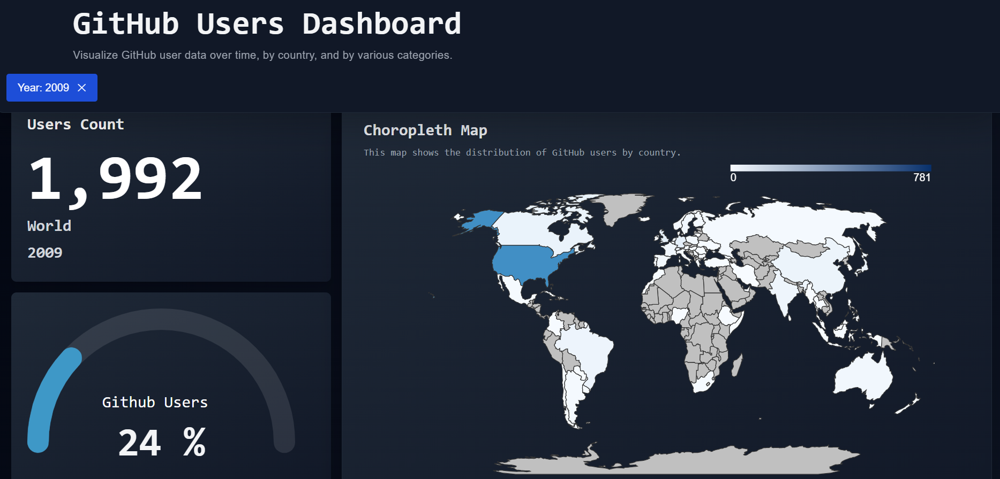
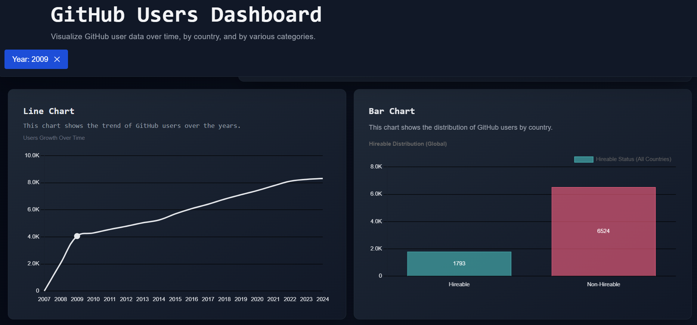
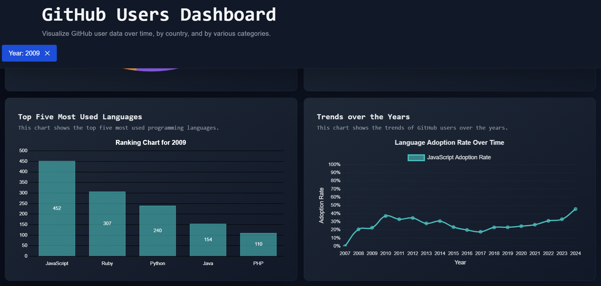
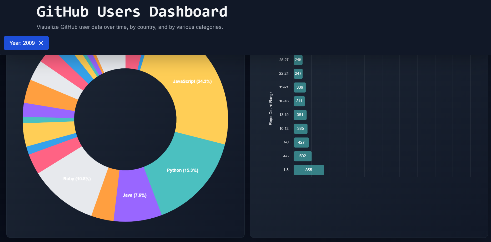

# Data Chautari

## Project Overview
Data Chautari is a web application designed to provide an intuitive and interactive dashboard for data visualization. The project focuses on showcasing insights derived from raw datasets, with all preprocessing handled independently in the backend. The goal is to enable users to explore and understand complex datasets through clean and visually engaging dashboards.

---

## Tech Stack
### Frontend:
- React
- D3.js
- Vite
- Tailwind CSS

### Backend:
- Python
- Pandas, NumPy (for preprocessing)
- Flask or FastAPI (if API is needed)

---

## Installation and Setup
### Backend:
1. Clone the repository and navigate to the backend directory.
2. Create a virtual environment:
   ```bash
   python -m venv .venv
   ```
3. Activate the virtual environment:
  - For macOS/Linux:
  ```bash
  source .venv/bin/activate
  ```
  - For Windows:
  ```bash
  .venv\Scripts\activate
  ```
4. Install the required dependencies
   ```bash
   pip install -r requirements.txt
   ```
### Frontend:
1. Navigate to Fronend directory
2. Install dependencies using pnpm
   ```bash
   pnpm install
   ```
3. Start the development server
   ```bash
   pnpm run dev
   ```
---

## Screenshots

### Dashboard View


### Data Visualization Example



### Table Display Example


## Usage
1. Preprocess the dataset using the provided Python scripts.
2. Serve the React application to visualize the final dataset through interactive dashboards.

---

## Contribution Guidelines
1. Fork the repository and create a new branch for your changes.
2. Follow best practices for code formatting and comments.
3. Submit a pull request with detailed explanations of your changes.

